# monitoring-dz02
Домашнее задание к занятию 14 «Средство визуализации Grafana»

Шаг 0  создаем окружение

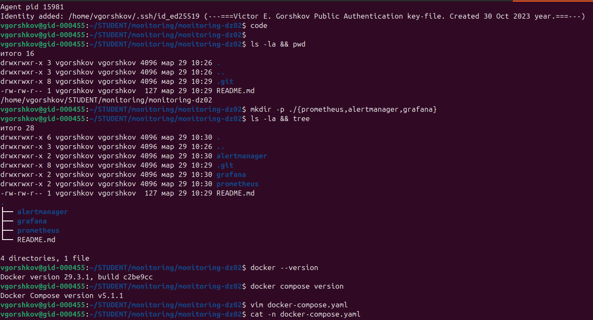

Примерная структура
Думаю реализовать, для открытия с хоста следующие сервисы:
http://localhost:9090 — Prometheus
http://localhost:9093 — Alertmanager
http://localhost:3000 — Grafana
http://localhost:9100 — node-exporter (метрики)

Запускаем сборку:

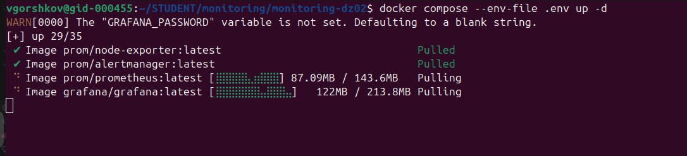
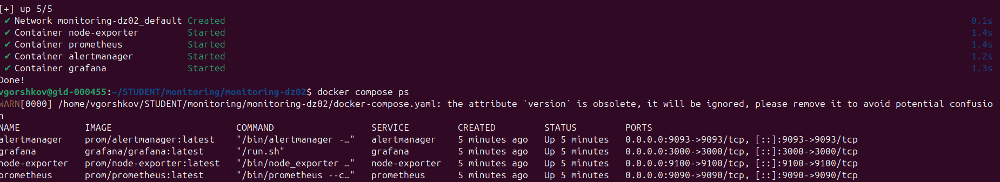

База подготовлена, переходим к заданиям.

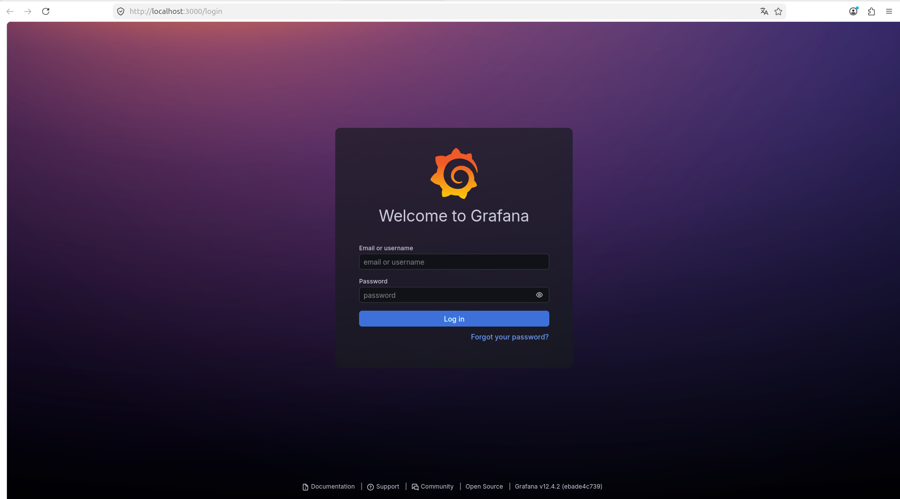

Добавляем connection
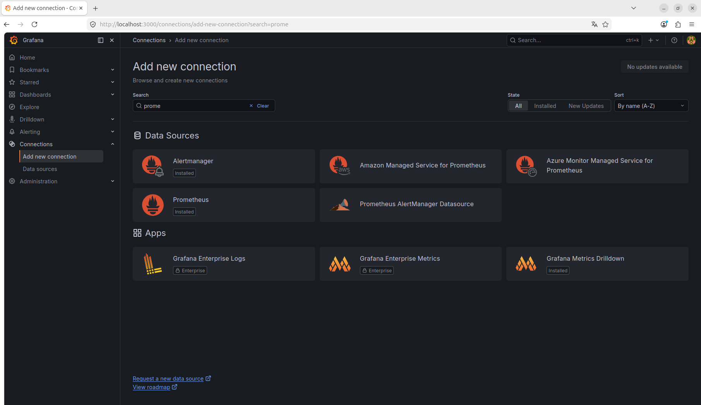

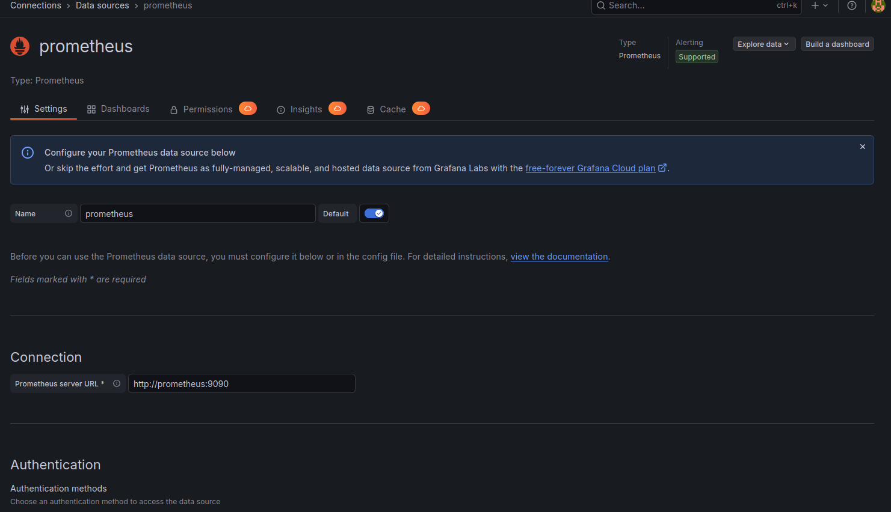
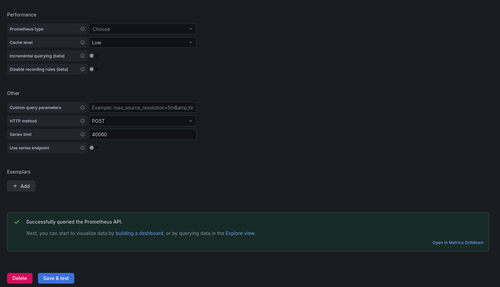

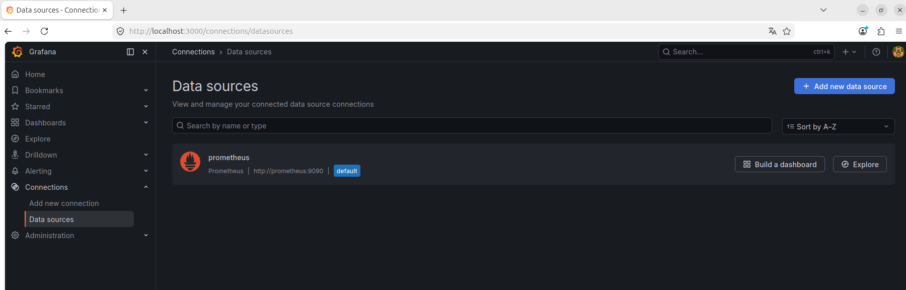
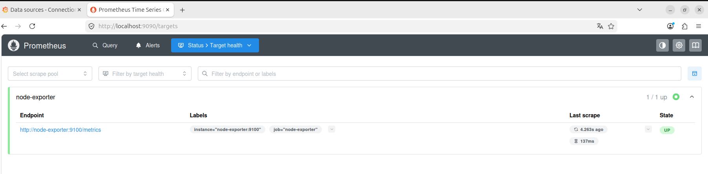

Подключение корректное.

Добавим дашборд.

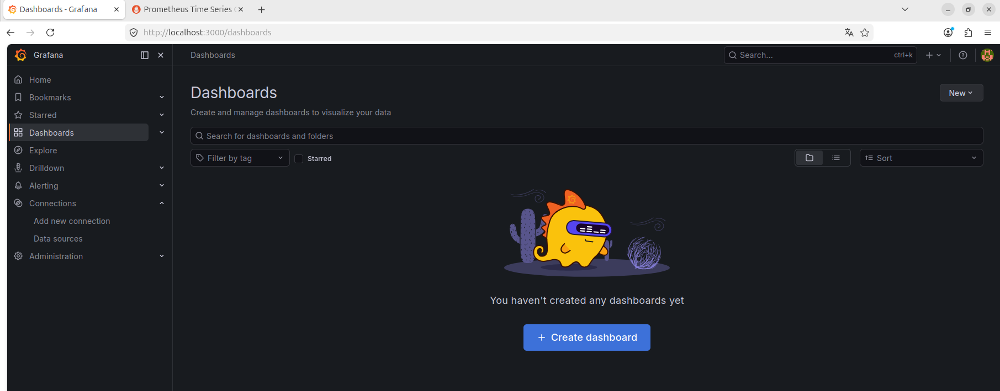

добавим визуализацию
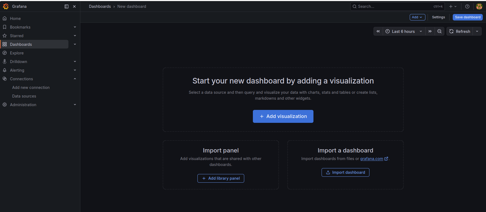

Источник прометеус
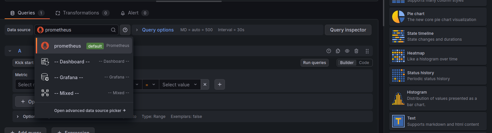

Создаем запрос, оформляем панель
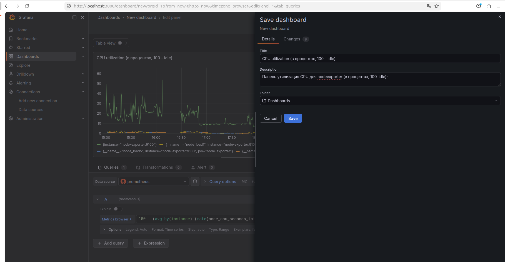

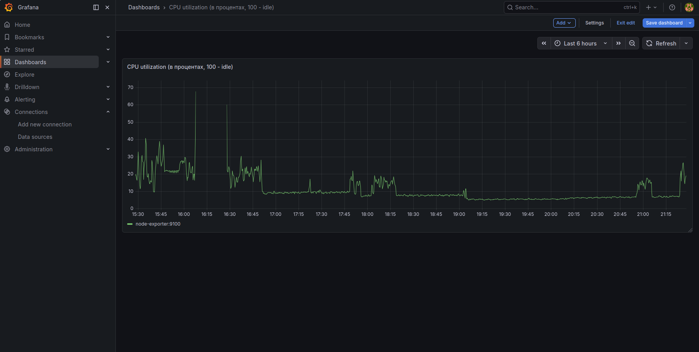

Создаем следующую новую панель на дашборде Load Average с тремя графиками
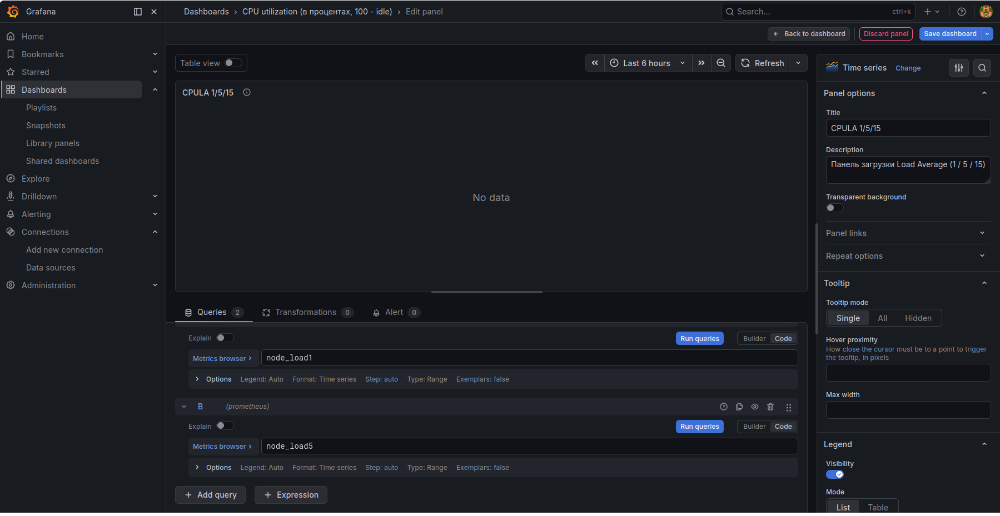

Выполняем настройку панели оперативной памяти, переводим единицы в настройках Unit в значение Гигабайты
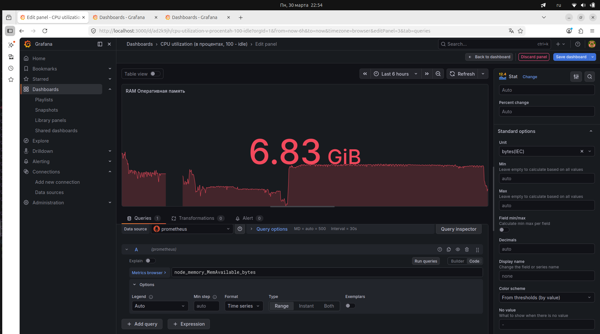
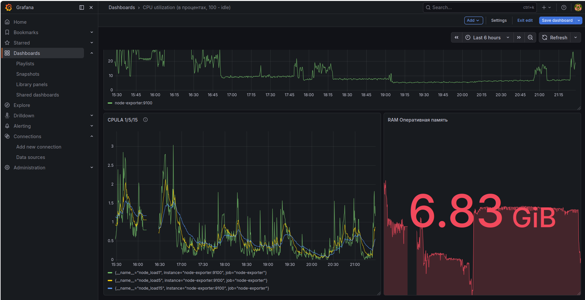

Сейчас node_memory_MemAvailable_bytes, переводим это в % соотношение
(node_memory_MemAvailable_bytes / node_memory_MemTotal_bytes) * 100
и unit меняем на  1-100%  Percent (0-100)
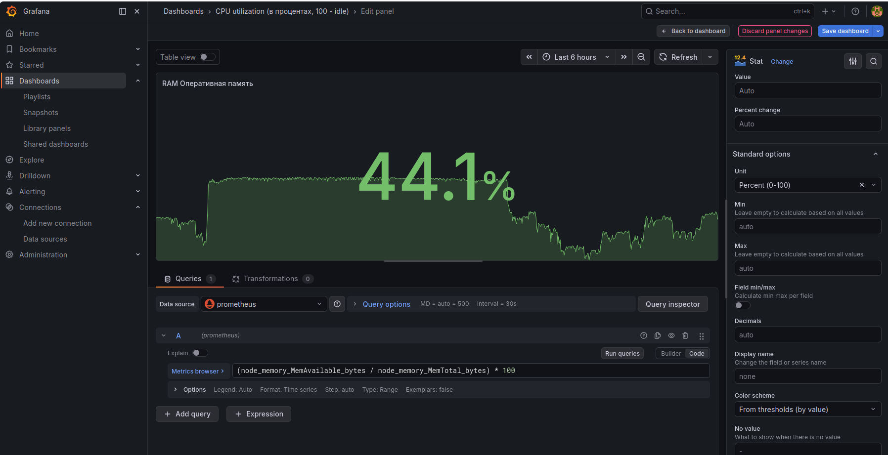

Настроим диск:
Получаем процент используемого места в % на диске.
(1 - (
  node_filesystem_avail_bytes{fstype!~"tmpfs|overlay", mountpoint="/"} 
  / 
  node_filesystem_size_bytes{fstype!~"tmpfs|overlay", mountpoint="/"}
)) * 100

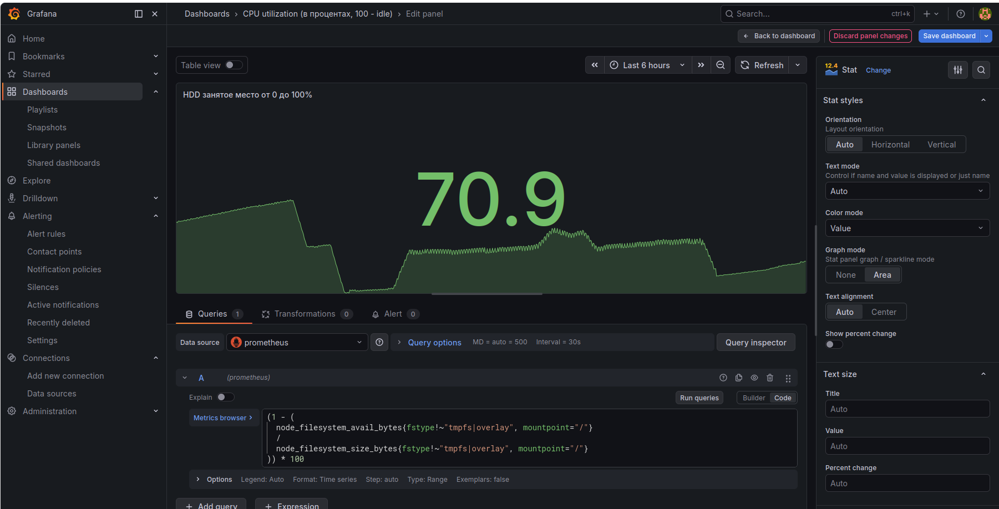

проверяем:

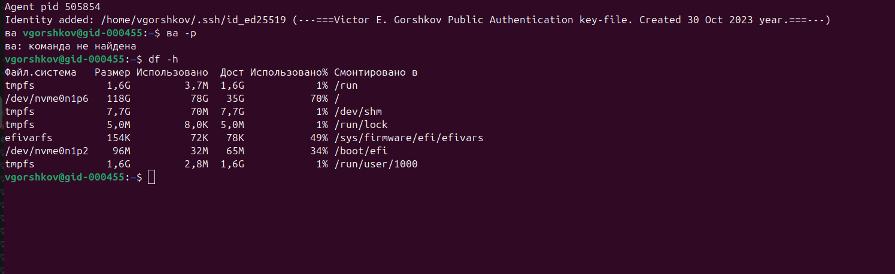

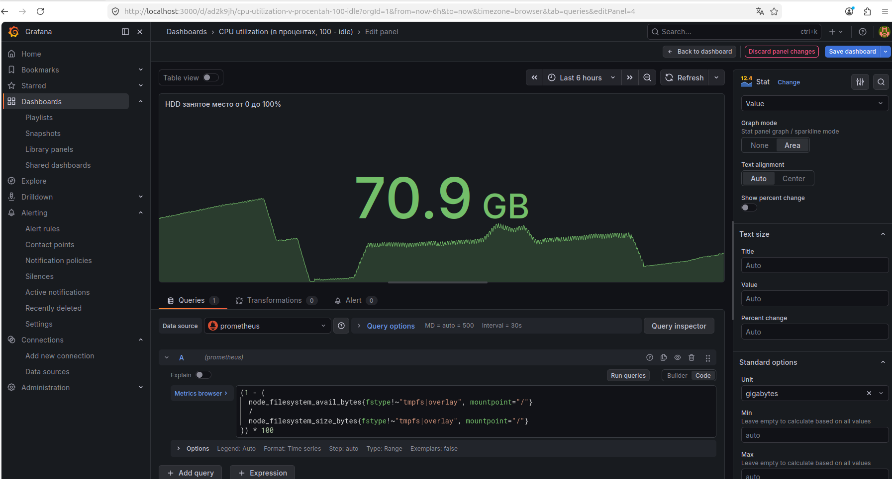

